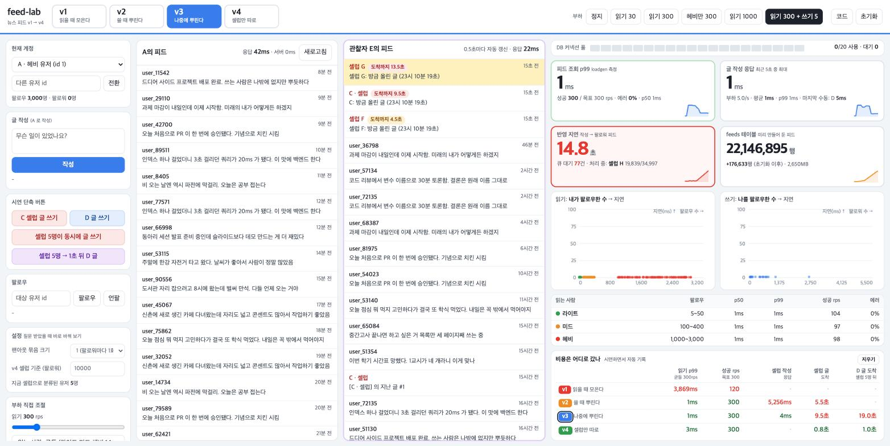

# feed-lab — 뉴스 피드를 v1 → v4 로 키워 보기

GDGoC Yonsei 5기 백엔드 파트 3주차 세션용 시연 프로젝트.
글 작성 / 팔로우 / 내 피드 조회, 기능은 이 셋뿐이다. 같은 기능을 네 가지 방식으로 구현해 놓고, 화면에서 버전을 바꿔 가며 **어디가 느려지는지**를 숫자로 본다.

| 버전 | 쓰기 | 읽기 | 좋아지는 것 | 대신 나빠지는 것 |
|---|---|---|---|---|
| **v1** 읽을 때 모은다 | `posts` 에 한 줄 | 팔로우한 사람마다 최근 글을 모아서 정렬 | 쓰기가 가장 단순 | 읽기 비용 ∝ **내가 팔로우한 수**. 부하가 몰리면 전원이 같이 느려진다 |
| **v2** 쓸 때 뿌린다 | 글 + 팔로워 전원의 `feeds` 에 INSERT (요청 안에서) | 내 `feeds` 20줄 | 읽기가 누구에게나 1~3ms | 쓰기 비용 ∝ **나를 팔로우한 수**. 셀럽은 글 하나에 5초 |
| **v3** 나중에 뿌린다 | 글 + "할 일"(`fanout_jobs`)을 한 트랜잭션에. 워커가 뿌림 | v2 와 같음 | 쓰기가 누구에게나 수 ms | 팔로워에게 늦게 뜬다. 셀럽 잡 뒤에 선 평범한 글은 20초 |
| **v4** 셀럽만 따로 | v3 + 셀럽(팔로워 1만 초과) 잡은 건너뜀 | `feeds` + 내가 팔로우한 셀럽 글을 읽을 때 가져와 합침 | 셀럽이 큐를 막지 않는다 | 읽기가 조금 비싸진다 |

> 비용은 사라지지 않고 옮겨 다닌다.

## 실행

준비물은 Docker Desktop 하나. (메모리 8GB 이상 할당. Settings → Resources)

```bash
make up                 # 빌드 + 기동. 처음엔 3~5분 (Gradle, 의존성 다운로드)
make seed               # 데이터 생성. 약 1분 (M4 Pro 기준 48초)
open http://localhost:8080
```

노트북 사양이 낮으면 절반 규모로: `make seed SCALE=0.5` (DB 2.2GB, 23초). 흐름은 똑같이 보이고 숫자만 조금 다르다.
다시 시드하려면 `make seed FORCE=1`, 전부 지우려면 `make nuke`. Windows 는 아래 [Windows 에서 실행](#windows-에서-실행) 참고.

| 명령 | 하는 일 |
|---|---|
| `make up` / `make down` | 기동(캐시 예열 포함) / 종료. 데이터는 볼륨에 남는다 |
| `make seed [SCALE=1] [FEED_DAYS=3]` | 시드 |
| `make reset` | 시드 이후에 쓴 글, 그 글의 feeds, 잡만 삭제 (화면의 **초기화** 버튼과 같다) |
| `make check` | 시연 시나리오를 자동으로 돌리고 수치를 점검 (약 3분). **발표 전에 한 번** |
| `make explain` | v1 쿼리를 A(헤비) / B(라이트) 로 `EXPLAIN ANALYZE` |
| `make warm` | 테이블과 인덱스를 메모리에 올림 (`make up` 이 자동으로 한다) |
| `make stats` / `make logs` | 컨테이너 자원 / 로그 |

## Windows 에서 실행

두 가지 길이 있다. **WSL2 를 권한다.** 그러면 위의 `make` 명령이 그대로 된다. (둘 다 macOS 에서 작성한 뒤 Windows 에서 직접 돌려 보지는 못했다. 막히는 게 있으면 알려 달라.)

**공통 준비**
1. [Docker Desktop for Windows](https://www.docker.com/products/docker-desktop/) 설치 (설치 중 WSL2 백엔드 기본값 그대로). 설치 후 한 번 재부팅.
2. 메모리 확보: WSL2 는 기본으로 RAM 의 절반만 쓴다. 8GB 이상이어야 하므로 `C:\Users\<이름>\.wslconfig` 파일을 만들고 (없으면 새로) 아래를 넣은 뒤 PowerShell 에서 `wsl --shutdown`, Docker Desktop 재시작.
   ```
   [wsl2]
   memory=10GB
   ```
   RAM 이 16GB 면 `memory=8GB` 로 하고 `SCALE=0.5` 로 시드한다.

**길 1 · WSL2 (권장)**
```powershell
wsl --install -d Ubuntu          # 이미 있으면 생략. 재부팅 후 Ubuntu 창에서 사용자 이름/비밀번호 설정
```
Docker Desktop → Settings → Resources → **WSL integration** 에서 Ubuntu 를 켠다. 그다음 Ubuntu 터미널에서:
```bash
sudo apt-get update && sudo apt-get install -y make git
git clone https://github.com/gdg-yonsei/gdg-5th-be.git ~/gdg-5th-be   # C: 드라이브(/mnt/c) 말고 WSL 안(~)에 받는다. 훨씬 빠르다
cd ~/gdg-5th-be/week3/feed-lab
make up && make seed             # 이후는 위와 똑같다 (make check, make reset, ...)
```
브라우저는 Windows 쪽에서 `http://localhost:8080` 을 열면 된다.

**길 2 · PowerShell 만으로**
`make` 대신 같은 폴더의 `lab.ps1` 을 쓴다. [Python 3](https://www.python.org/downloads/windows/) 이 필요하다 (`make check` 용. 설치할 때 "Add python.exe to PATH" 체크).
```powershell
Set-ExecutionPolicy -Scope CurrentUser RemoteSigned    # 처음 한 번. 스크립트 실행 허용
git clone https://github.com/gdg-yonsei/gdg-5th-be.git
cd gdg-5th-be\week3\feed-lab
.\lab.ps1 up
.\lab.ps1 seed                  # 절반 규모: .\lab.ps1 seed -Scale 0.5
.\lab.ps1 check                 # 발표 전 점검
```
`reset`, `warm`, `explain`, `stats`, `logs`, `down`, `nuke` 도 이름이 같다. 다시 시드는 `.\lab.ps1 seed -Force`.

**Windows 에서 막히면**
- `gradlew: not found` 또는 `bash\r` 오류로 빌드가 실패한다 → 줄바꿈이 CRLF 로 바뀐 것. 저장소의 `.gitattributes` 가 막아 주지만, 옛날에 받았거나 에디터가 바꿨다면 `git config core.autocrlf false` 후 다시 clone.
- `bind: An attempt was made to access a socket in a way forbidden` → Windows 가 8080 이나 8081 을 예약해 둔 것. `netsh interface ipv4 show excludedportrange protocol=tcp` 로 확인하고, 겹치면 재부팅하거나 `docker-compose.yml` 의 포트를 바꾼다 (loadgen 포트를 바꾸면 `LOADGEN_PORT` 도 같이).
- 시드가 유난히 느리다 (5분 이상) → 저장소가 `/mnt/c` 아래에 있거나 Docker 메모리가 부족한 것. 위 `.wslconfig` 확인.
- 한글이 깨진다 → PowerShell 5.1 이면 `.\lab.ps1` 이 알아서 UTF-8 로 바꾼다. 직접 `docker exec` 를 칠 때는 먼저 `chcp 65001`.

## 화면



- **위**: 버전(단축키 `1`~`4`), 부하 프리셋, `지표 크게`(단축키 `M`. 조작 패널과 피드를 치우고 상황판만으로 화면을 채운다. 이 모드에서 시연 버튼은 `Q` `W` `E` `R` 키로 누른다), `코드`(단축키 `C`. 지금 버전의 실제 소스를 보여준다), `초기화`
- **왼쪽**: 계정 전환, 글 작성, 시연 단축 버튼, 팔로우, 설정(팬아웃 묶음 크기 / v4 셀럽 기준을 실행 중에 변경), 부하 직접 조절
- **가운데**: 내 피드(응답 시간 표시)와 **관찰자 E 의 피드**. E 는 0.5초마다 자기 피드를 읽고, 새로 뜬 글에 `도착까지 N초`(= 처음 보인 시각 − 작성 시각) 배지를 붙인다
- **오른쪽 상황판**
  - DB 커넥션 풀: 20칸. 다 차면 빨개지고 대기 수가 올라간다
  - 카드 4개: 피드 조회 p99 / 글 작성 응답 / 반영 지연 / feeds 행 수. 문제가 생긴 칸이 빨개진다
  - 산점도 2개: `읽기: 내가 팔로우한 수 → 지연`, `쓰기: 나를 팔로우한 수 → 지연`. 빨간 ✕ 는 실패한 요청
  - 코호트 표, 그리고 **비용은 어디로 갔나**: 시연하면서 버전별 값이 자동으로 채워지는 기록표

숫자의 출처: 피드 p99 와 쓰기 지연은 부하 생성기(loadgen)가 **클라이언트 입장에서** 잰 값이다. 서버가 밀려서 줄 서 있는 시간까지 포함해야 "처리량 천장"이 보인다.

## 데이터와 페르소나 (SCALE=1)

| | |
|---|---|
| users | 10만. 팔로우 수 기준 라이트 70% (5~50명) / 미드 27% (100~400) / 헤비 3% (1,000~3,000) |
| follows | 약 1,460만 (평균 146). 인기는 멱법칙이지만 자연 발생 팔로워는 최대 4천 명대에서 끊는다 |
| posts | 300만, 최근 60일 |
| feeds | 약 2,200만 행 (최근 3일 글만 미리 팬아웃), DB 전체 4.4GB |

| id | 이름 | 특성 | 쓰임 |
|---|---|---|---|
| 1 | A · 헤비 유저 | 활발한 유저 3,000명 팔로우 | v1 에서 느린 사람 |
| 2 | B · 라이트 유저 | 20명 팔로우 | v1 에서 빠른 사람 |
| 3 | C · 셀럽 | 팔로워 5만 (전체의 절반) | v2 쓰기가 느려지는 사람 |
| 4 | D · 일반 작성자 | 팔로워 200 | v3 에서 셀럽 뒤에 줄 서는 사람 |
| 6~9 | 셀럽 F, G, H, I | 팔로워 4.5만 / 4만 / 3.5만 / 3만 | "셀럽 5명이 동시에" 버튼용 |
| 100000 | E · 관찰자 | C, D, 셀럽 4명 + 30명 팔로우 | 도착 배지의 주인 |

E 만 맨 끝 id 인 이유: 팬아웃은 팔로워 id 순서로 나간다. 그래서 E 는 항상 **가장 늦게 받는 팔로워**이고, E 피드에 글이 뜬 순간이 곧 그 글의 팬아웃이 끝난 순간이다. 배지가 매번 같은 뜻을 갖게 하려는 장치다.

## API

인증은 없다. 모든 요청에 `X-User-Id` 헤더.

| | |
|---|---|
| `POST /v{1..4}/posts` `{"content": "..."}` | 글 작성. 버전마다 하는 일이 다르다 |
| `GET /v{1..4}/feed?cursor=` | 내 피드 20개. 커서는 `(created_at, id)` 를 base64 로 (모든 버전 공통) |
| `POST` / `DELETE /follows/{id}` | 팔로우 / 언팔로우 |
| `GET /users/{id}`, `GET /personas` | 유저 정보 |
| `GET /config`, `POST /config` | 묶음 크기, 셀럽 기준 조회 / 변경 |
| `GET /metrics-lite` | 상황판용 메트릭 (1초마다 미리 계산해 둔 스냅샷) |
| `POST /admin/reset` | 초기화 |
| loadgen `:8081` `POST /control`, `GET /stats` | 부하 설정 / 최근 5초 통계 |

## 장표

`slides/index.html` 한 파일이다. 더블클릭해서 브라우저로 열면 되고 인터넷은 필요 없다.

- `→` `Space` 다음 (한 장 안에서도 단계별로 나온다), `←` 이전, `F` 전체 화면, `N` 발표자 메모, 주소 뒤 `#12` 로 바로 이동
- 버전마다 같은 순서다: 앞 버전의 문제 상황 → 핵심을 고치는 애니메이션 → 설명 → 바뀐 구조 → **시연**(어두운 장표에 누를 버튼 순서가 적혀 있다) → 바뀐 것과 다음 질문
- 발표할 때는 브라우저 탭 둘(장표, 대시보드)만 오가면 된다. 코드는 대시보드의 `C` 키로 본다

## 코드 읽는 순서

핵심은 `app/src/main/kotlin/com/example/feedlab/versions/` 의 파일 네 개다. 버전 하나가 파일 하나이고, 쓰기와 읽기가 한 화면에 들어온다. 화면의 `코드` 버튼이 보여주는 것도 이 파일 그대로다.

```
versions/V1PullOnRead.kt   LATERAL 쿼리 하나
versions/V2SyncFanout.kt   @Transactional 안에서 fanout.deliver(post)
versions/V3Outbox.kt       같은 트랜잭션에 잡 INSERT + 1초마다 도는 워커
versions/V4Hybrid.kt       워커는 셀럽을 건너뛰고, 읽을 때 셀럽 글을 합친다
core/Fanout.kt             팔로워 수만큼 feeds INSERT (v2 와 워커가 같이 쓴다)
db/migration/V1~V3.sql     스키마. 버전이 올라가며 테이블이 하나씩 늘어난다
```

그 밖: `metrics/` 상황판 메트릭, `api/` 컨트롤러, `loadgen/` 부하 생성기(open-loop), `seed/seed.sql` 시드.

## 실측 (M4 Pro, Docker CPU 12 / 메모리 8GB, SCALE=1, `make check` 결과)

| 장면 | v1 | v2 | v3 | v4 |
|---|---|---|---|---|
| 읽기 300rps: 성공 rps / p99 | **121 / 3,794ms** (에러 60%) | 300 / 3ms | 300 / 2ms | 300 / 3ms |
| 읽기 1,000rps | - | 1,000 / 2ms | | |
| 일반 글 쓰기 평균 | 2ms | **83ms** (p99 174) | 2ms | 2ms |
| 셀럽 C 글 쓰기 응답 | 2ms | **5,332ms** | 3ms | 3ms |
| 셀럽 글이 E 에게 도착 | 즉시 | 5.5초 (응답과 동시) | 5.9초 | **1.0초** (읽을 때 가져옴) |
| 셀럽 5명 뒤에 쓴 D 글 도착 | - | - | **20.0초** | **0.5초** |

v1 저부하(30rps)에서는 라이트 4ms / 미드 11ms / 헤비 55ms 로 팔로우 수에 비례한다. 단건으로는 A 47ms, B 4ms.
v1 고부하에서는 라이트 3,087ms / 헤비 3,807ms 로 **전원이 같이** 느려진다. 같은 커넥션 풀 앞에 한 줄로 서기 때문이다.

`make explain` 의 핵심 두 줄:

```
A  Nested Loop (rows=60000)  ... Index Scan on posts (loops=3000)   Buffers: shared hit=69287   Execution Time: 92.7 ms
B  Nested Loop (rows=400)    ... Index Scan on posts (loops=20)     Buffers: shared hit=468     Execution Time: 0.75 ms
```

## 값 조정

숫자가 기대와 다르게 나오면 (`make check` 가 알려준다):

| 변수 | 기본 | 효과 |
|---|---|---|
| `DB_CPUS` | 2 | DB 컨테이너 CPU 제한. **v1 의 천장 높이를 정한다.** 2개면 균등 부하 약 120rps 가 한계. 제한을 풀면 M4 Pro 에서 700rps 까지 받아서 300rps 로는 문제가 안 보인다. `make up DB_CPUS=3` |
| `FANOUT_BATCH_SIZE` | 1 | feeds INSERT 를 몇 행씩 묶나. 1 이면 팔로워 한 명당 한 번 왕복(초당 약 1만 행). 5만 팔로워 기준 1 → 5.3초, 2 → 2.4초, 5 → 1.3초, 20 → 0.65초, 1000 → 0.35초. 화면에서 실행 중에도 바꿀 수 있다 |
| `HYBRID_THRESHOLD` | 10000 | v4 에서 셀럽으로 보는 팔로워 수 |
| `WORKER_INTERVAL_MS` | 1000 | v3 워커 주기 |
| `DB_POOL` | 20 | 앱의 DB 커넥션 수 |
| `LOADGEN_CPUS` | 6 | 부하 생성기 CPU 제한. 3개면 약 1만 rps 에서 부하기가 먼저 포화된다. 6개면 v2 의 실제 천장(약 1.7만 rps, DB CPU 2개가 한계)까지 볼 수 있다 |
| `SCALE`, `FEED_DAYS` | 1, 3 | 시드 규모, feeds 에 미리 넣어 둘 최근 일수 |

## 문제 해결

- `make up` 뒤 화면이 비어 있다 → 아직 시드 전이다. `make seed`
- 포트 충돌(8080, 8081, 5435) → 쓰는 프로세스를 끄거나 `docker-compose.yml` 의 포트 수정
- 재부팅 직후 첫 숫자가 유난히 크다 → 캐시가 식은 것. `make warm` (`make up` 은 자동으로 한다)
- 시드가 실패했다 → `make nuke && make up && make seed`
- 화면이 잘린다 → 브라우저 전체 화면(⌃⌘F). 1512×860 이상이면 피드와 상황판이 한 화면에 들어온다 (왼쪽 조작 패널만 스크롤)
